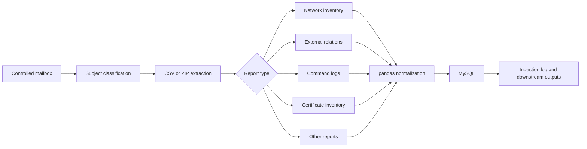

# Telecom Report Ingestion Pipeline

A sanitized archive of a Python service developed collaboratively by **Alexandre Torres** and **Fabio Vilela** while supporting a telecom network-operations team.

The service automated a recurring data-ingestion workflow behind an internal operations portal. Reports arriving in a controlled mailbox were classified from a structured subject, extracted from CSV or ZIP attachments, transformed with pandas and loaded into MySQL. Successful and failed runs were recorded, while selected outputs could be routed to other operational workflows.

> **Archive status**
>
> The original service and the portal it supported have been retired. This repository preserves the Python architecture and report-specific transformation modules as a read-only portfolio archive. It is not configured for a production network.

The dependency ranges in `requirements.txt` reflect the legacy runtime expected by the preserved code. The automated checks validate syntax, sanitisation controls and archive integrity; they do not claim production readiness on a current Python stack.

## Why it mattered

The portal depended on frequently refreshed data from several radio technologies and operational checks. Preparing and loading those reports manually would have required repeated file handling, schema normalization, deduplication and database work.

The pipeline provided a common orchestration layer:

1. connect to a dedicated mailbox;
2. interpret a structured report subject;
3. save CSV attachments or safely extract ZIP packages;
4. select the relevant transformation module;
5. normalize and merge the latest dataset with pandas;
6. load it into MySQL through SQLAlchemy;
7. record the ingestion result and prepare downstream notification packages.

## Preserved architecture



The public copy retains the seven original Python modules:

- `main.py` — mailbox orchestration and report routing;
- `networks.py` — 2G, 3G, 4G and 5G inventory transformations;
- `externals.py` — inter-technology neighbour and external-cell transformations;
- `hua_logs.py` — operational command-log parsing;
- `pki.py` — certificate-inventory transformation;
- `others.py` — generic report ingestion;
- `aux_func.py` — file, dataframe, database, logging and packaging helpers.

## Configuration

Copy `config.example.ini` to `config.ini` and replace every placeholder. The runtime configuration is intentionally ignored by Git.

```powershell
Copy-Item config.example.ini config.ini
$env:REPORT_PIPELINE_CONFIG = "$PWD\config.ini"
python main.py
```

The example uses only `.invalid` mail domains and placeholder credentials. A real deployment would need a compatible IMAP mailbox, MySQL schema and input reports matching the historical contracts described in [`docs/report-contracts.md`](docs/report-contracts.md).

## Relationship with Phoenix and GIL

This was a backend ingestion service, not the Phoenix web interface itself. It refreshed datasets consumed by the portal. One report route also copied an approved weekly-plan file into the separate incident-assignment workflow later archived as GIL. These integrations explain the shared database vocabulary without presenting this repository as part of either user interface.

## Authorship

Developed collaboratively by Alexandre Torres and Fabio Vilela. Fabio does not have a GitHub account, so GitHub's contributor panel cannot represent his authorship; it is recorded explicitly in [`AUTHORS.md`](AUTHORS.md).

## Privacy and sanitisation

This archive contains no production credentials, mailboxes, internal distribution lists, corporate paths, operational reports or database contents. Configuration and infrastructure-specific recipients were moved to an external example file. See [`NOTICE.md`](NOTICE.md).

## Technology

Python, pandas, NumPy, IMAP, CSV/ZIP processing, SQLAlchemy and MySQL.

## Use and attribution

This repository is published for portfolio review and historical reference. No open-source licence is granted. See [NOTICE.md](NOTICE.md) for the scope and attribution record.
